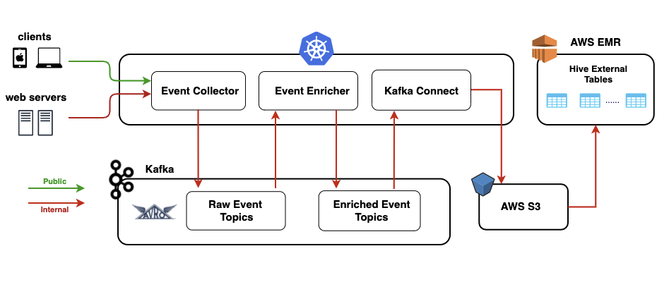

# Udemy's Application design to track live events

    https://medium.com/udemy-engineering/designing-the-new-event-tracking-system-at-udemy-a45e502216fd

## High level design

    

## Key decisions and components used

    Design
        Event based design was selected since there was need for real time event processing

    Serialisation format
        JSON for frontend clients while using binary Avro serialization for internal events.
        Avro or Protobuf suited for internal format. Avro was selected as it has stricter schema compatibility rules

## Few additional points

    Crucial differences between Avro vs Protobuf:
        1) Avro has a concept of required/optional fields. In Protobuf (v3), every field is optional.
        2) Avro is integrated natively with some of the data systems we use such as Hive, Presto.
        3) Protobuf natively supports code generation across many languages, while Avro only supports it for Java.
        4) Reading Avro data requires the writer’s schema to be present along with the reader’s schema.
        5) If your Avro schemas will need to evolve in time, you need a schema registry to reference schemas without storing the whole schema with the data. 
